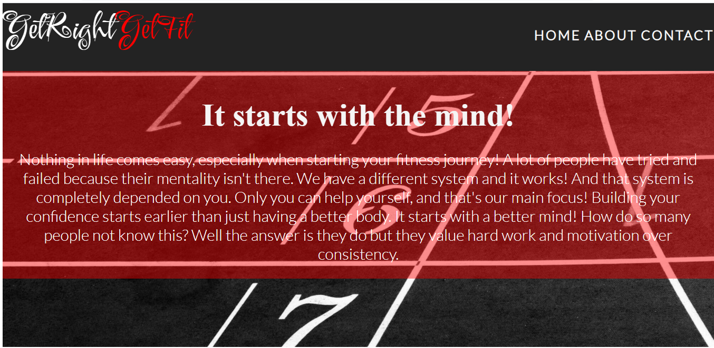

# GetRightGetfit

GetRightGetFit is a website designed to help you reach your goals.
How often have you heard "I'll start tomorrow" or other excuses that keeps repeating over and over again?
This is a website designed to make your mindset fitness ready and consistent. This is for people who are looking to stay fit forever.

## Features 

The page consists of three different sections and in all of them you can see that the main focus is for people to achieve their fitness goals. And this page offers those things and by sending in the form they will recieve the help they need.

### Existing Features

- __Navigation Bar__

  All three pages feature their own unique design and information, with an identical design and a nice styled hover button. Easily accessible and does not need to scroll down if not needed. This is a fully responsive navigation bar and makes navigating through the website a breeze.

- __The header image__

  - The header image includes a photo along with a text and header that motivates you.

  - This introduction starts of with an eye catching opener that let's you know off the bat that it's related to the mindset. And a text explaining how this is relevant.

- __About Section__

  - This section is ABOUT the website, the whole purpose of it and how with motivation alone achieving goals might be difficult. 

  - This is a way for attracting customers to become more curious about it and then join.

__The Footer__ 

  - I added a footer with social links that take you to respective website upon clicking

  - The footer let's you know we're connected and on social media which might make people with a lot of screen time more engaged.

  - __The Sign Up Page__

  - This page allows users to input information that we need from them in order to help them achieve their goals. The user needs to submit information in the form and there's examples of what's needed that will make it easier for the website visitor and it works as a guide.

  ## Testing 

In this section, you need to convince the assessor that you have conducted enough testing to legitimately believe that the site works well. Essentially, in this part you will want to go over all of your project’s features and ensure that they all work as intended, with the project providing an easy and straightforward way for the users to achieve their goals.

In addition, you should mention in this section how your project looks and works on different browsers and screen sizes.

You should also mention in this section any interesting bugs or problems you discovered during your testing, even if you haven't addressed them yet.

If this section grows too long, you may want to split it off into a separate file and link to it from here.

### Validator Testing 

- HTML
  - No errors were returned when passing through the official [W3C validator]
    

- CSS
  - No errors were found when passing through the official [(Jigsaw) validator]
 
 
 **My bug**
 
 
  ### Unfixed Bugs

  Only bugs I didn't fix were on lighthouse and the reason for why is simply because the accessibility is already at 100 and I was told on the video that's the main focus.

  ## Deployment

- The site was deployed to GitHub pages. The steps to deploy are as follows: 
  - In the GitHub repository, navigate to the Settings tab 
  - From the source section drop-down menu, select the Master Branch
  - Once the master branch has been selected, the page will be automatically refreshed with a detailed ribbon display to indicate the successful deployment. 

The live link can be found here - https://hussensalali.github.io/hussensalali-hussensalahali-ms1_portfolio_project-/
## Credits 

first I would like to thank these wonderful people!

David Bowers , Irish Becky , **Matt Bodden**

The love running project , HTML and CSS module and I used the readme as a template
_____________________________________________

                   
**CONTENT**

paint

tinypic

fontawesome

https://web.dev/

ami responsive

________________________________________________
**MEDIA**

https://unsplash.com/@liplip for singup section

https://unsplash.com/@theeastlondonphotographer for home page header (tackfield)

https://unsplash.com/@risennnnn for about section

https://unsplash.com/@victorfreitas for contact image
